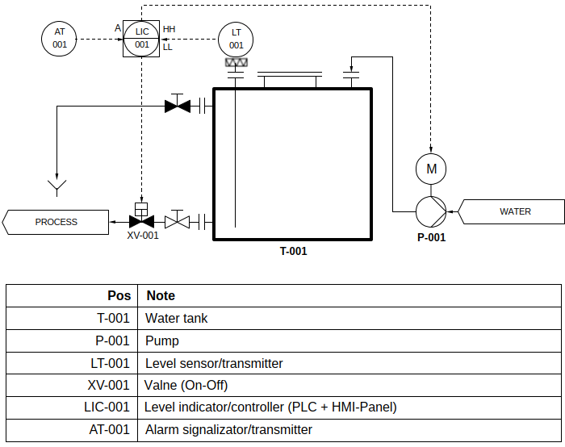

# examples-easybuilder

002-mnemoscheme

## TARGET OBJECT

scheme

P&ID

### Hardware Platform

- Sensors
- Actuators
- Field Signal Cables (FieldBus)
- Digital Control Bus (ModBus TCP)
- PLC + I/O modules
- Local panel

## PLC

- Survey Sensors
- Execute Control programm
- Control Actuators
- Net transfer with Panel

### Hardware Platform

- Model
  - unknown
- Modules
  - CPU
  - Net (Ethernet / LAN1)
  - DI
  - DO
  - AI
  - AO

### Software Platform

- Target
  - unknown
- Control Program
  - ready, loaded
- ModBus TCP Slave Server
  - LAN1
  - 192.168.11.218:503
  - Station ID: 1
  - Pool-timeout (recomendation): 300msec
  - Registers map (see doc/spec.xlsx)

## Panel

- HMI
- Net transfer with PLC

### Hardware Platform

- Model
  -  Weintek MT8071iE
- Sensor HMI panel
 Net (Ethernet / LAN1)

### Software Platform

- Target
  - EasyBuilder Pro V6
- Control Program
  - this example
- ModBus TCP Master Pool
  - LAN1
  - 192.168.11.219
  - Station ID: 2
- IDE
  - EasyBuilder Pro V6

## Example

Develop a HMI for sensor panel in IDE Easybuilder

- Main Screen
  - mnemoscheme, animated
    - water tank + pipes
    - pump (+ bitlamp indicator)
    - valve (+ bitlamp indicator)
    - alarm (+ bitlamp indicator, blink indicator)
    - process state (+ word indicator, text)

- Menu Screen
  - indicator from Main Screen
  - input setpoint of level to stop pump
  - language selector

## Software

- [ModBus Simulator](https://disk.yandex.ru/d/yNPe6zgryWQgtg)
- [EasyBuilder PRO](https://www.rusavtomatika.com/download)
