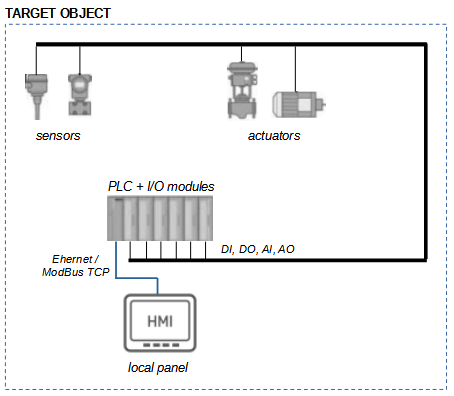
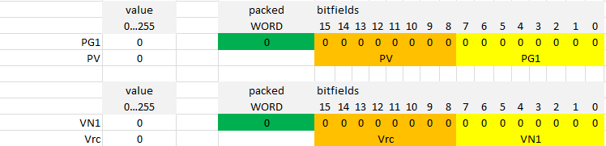

# examples-easybuilder

first-start1

## TARGET OBJECT

### Hardware Platform

- Sensors
- Actuators
- Field Signal Cables (FieldBus)
- Digital Control Bus (ModBus TCP)
- PLC + I/O modules
- Local panel

## PLC

- Survey Sensors
- Execute Control programm
- Control Actuators
- Net transfer with Panel

### Hardware Platform

- Model
  - unknown
- Modules
  - CPU
  - Net (Ethernet / LAN1)
  - DI
  - DO
  - AI
  - AO

### Software Platform

- Target
  - unknown
- Control Program
  - ready, loaded
- ModBus TCP Slave Server
  - LAN1
  - 192.168.11.218:503
  - Station ID: 1
  - Pool-timeout (recomendation): 300msec
  - Registers map (see doc/spec.xlsx)

## Panel

- HMI
- Net transfer with PLC

### Hardware Platform

- Model
  -  Weintek MT8071iE
- Sensor HMI panel
 Net (Ethernet / LAN1)

### Software Platform

- Target
  - EasyBuilder Pro V6
- Control Program
  - this example
- ModBus TCP Master Pool
  - LAN1
  - 192.168.11.219
  - Station ID: 2
- IDE
  - EasyBuilder Pro V6

## Example

- It is necessary to display on the panel screen the values of the PLC registers
  - PV
    - table / address
      - HOLDING REG (3x) / 21 (hi-byte)
  - VN1
    - table / address
      - HOLDING REG (3x) / 23 (lo-byte)
- Perform scaling of the displayed values
  - 0...255 scale to 0...100%

## Software

- [ModBus Slave Simulator](https://disk.yandex.ru/d/Y9-PAB4LVc-CMw)
- [EasyBuilder PRO](https://www.rusavtomatika.com/download)
